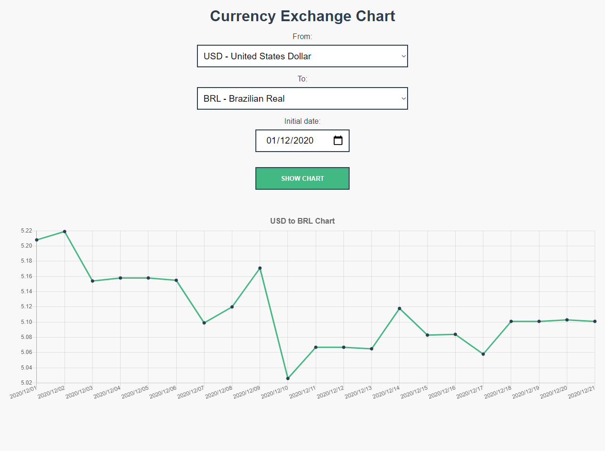

# Currency Exchange Chart

A simple UI to display exchange rates in charts.



## Build With

- [Vue](https://vuejs.org) - A progressive, incrementally-adoptable JavaScript framework for building UI on the web.
- [Vue Chart.js](https://vue-chartjs.org) - A Vue.js wrapper for [Chart.js](https://www.chartjs.org), that is a JavaScript charting using HTML5 &lt;canvas>.
- [Axios](https://github.com/axios/axios) - A promise based HTTP client for the browser and node.js.
- [SCSS](https://sass-lang.com) - The most mature, stable, and powerful professional grade CSS extension language in the world.
- [Exchange rates API](https://exchangerate.host/#/) - A simple and lightweight free service for current and historical foreign exchange rates

## Demo

Demonstration online by [GitHub Pages](https://pages.github.com) on this [link](https://lucas-santosp.github.io/currency-exchange/).

## Project setup

```
npm install
```

### Compiles and hot-reloads for development

```
npm run serve
```

## License

This project is licensed under the MIT License - see the LICENSE.md file for details
